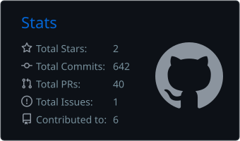
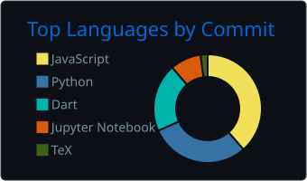

  

  

  

## 👨‍💻 About Me  

💡 Passionate **Software Engineer** specialized in **Mobile Development (Flutter, Dart, Clean Architecture)** and **Fullstack Solutions (Spring Boot, Angular)**.  
🎯 I focus on building **scalable, performant, and user-friendly applications** with attention to detail & clean code principles.  

---

### 🛠️ What I Do
- 📱 Cross-platform apps with **Flutter**
- 🗄️ Backend APIs with **Spring Boot/  ExpressJS**
- 🎨 UI/UX with **modern & responsive design**
- ⚡ Clean Architecture, SOLID, Testing & Best Practices  

---

### 🌱 Currently
- 🚀 Growing my expertise in **High Scale Applications**
- 📚 Learning & sharing knowledge through projects and posts
- 🤝 Open to **collaborations & freelance opportunities**

---

<h2> 🚀 &nbsp;Some Tools I Have Used and Learned</h2>

  <!-- IDEs -->
  
  

  <!-- Mobile -->
  
  
  

  
  
  <!-- Web -->
  

  <!-- Backend -->
  

  <!-- Databases -->
  
  

  <!-- Cloud / Auth -->
  

  <!-- Tools -->
  

``
<h2>  &nbsp;My Github History</h2>

  
  

<picture>
  <source media="(prefers-color-scheme: dark)" srcset="https://raw.githubusercontent.com/mehdi-elouissi/mehdi-elouissi/output/github-snake-dark.svg" />
  
</picture>

